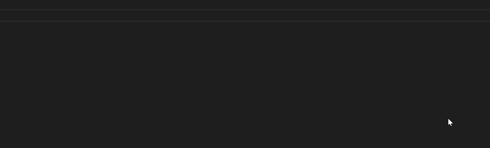

# Scripting engine documentation

[](https://travis-ci.org/SinusBot/scripting-docs)

This repository contains the [JSDoc](http://usejsdoc.org) based javascript file from which the [scripting engine documentation](https://sinusbot.github.io/scripting-docs/) is generated.

## Introduction

Check out our guide in the [SinusBot Documentation](https://sinusbot.github.io/docs/scripts/) for explanations on how to get started.

## IntelliSense

There are TypeScript typings available which are generated out of the documentation. You can use them in IDEs like Visual Studio Code.

### Visual Studio Code



First of all you need to install the typings by executing: `npm i sinusbot-scripting-engine` or `yarn add sinusbot-scripting-engine`.

After you have the typings installed, you need to create a `jsconfig.json` in the folder where you develop your scripts with the following content:

```json
{
    "compilerOptions": {
        "checkJs": true,
        "target": "es2018",
        "types" : ["sinusbot-scripting-engine"]
    },
    "typeAcquisition": {"enable": false, "include": ["sinusbot-scripting-engine"]},
    "exclude": [
        "node_modules",
        "**/node_modules/*"
    ]
}
```

For reference, you can check out [this repository](https://github.com/SinusBot/scripts).

## Build

### Install dependencies

```bash
npm install
```

### Generate html files

```bash
npm run generate-docs
```

### Serve locally

```bash
npm run serve-docs
```

### Generate d.ts

```bash
npm run generate-ts
```
